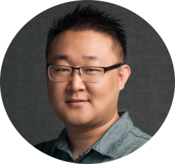

---
# Feel free to add content and custom Front Matter to this file.
# To modify the layout, see https://jekyllrb.com/docs/themes/#overriding-theme-defaults

layout: page
title: CVMC Lab's K-12 Summer Program 2025
---

[Team](#instruction-team) - [Schedule](#meeting-schedule) - [Description](#course-description) - [Material](#course-material) - [Projects](#student-projects-in-progress) - [Final Presentation](#final-group-presentation)
---

## Instruction Team

 &nbsp;&nbsp;&nbsp;&nbsp; 

*&nbsp;&nbsp;&nbsp;&nbsp;&nbsp;&nbsp;&nbsp;&nbsp;&nbsp;&nbsp;Advisor: [Dr. Yapeng Tian](https://www.yapengtian.com/) &nbsp;&nbsp;&nbsp;&nbsp; Teaching Assistant: Siva Sai Nagender Vasireddy*

## Meeting Schedule
The class will meet twice a week over a period of 8 weeks.
- Time : 10:30 AM to 3:30 PM on Mondays and Wednesdays
- Dates : June 1st 2025 to July 30th 2025
- Location : ECSS 2.203

The students are expected to work on their assignments and projects at home on the other days of the week.

## Course Description
Deep learning has significantly advanced research in computer vision and multimodal computing by enhancing performance in image and video-based tasks such as classification, generation, and more. To build a foundational understanding of deep learning, students will begin by exploring gradient descent and its application in solving linear regression problems. They will then analyze and compare key neural network architectures, including fully connected neural networks, convolutional neural networks, and transformers. Through hands-on practice using tools like Python and PyTorch, students will gain experience training various neural network models. To demonstrate their understanding, students will investigate the Active Speaker Detection (ASD) problem and propose potential enhancements. Additionally, students will have the opportunity to apply their knowledge by engaging in research projects focused on computer vision and multimodal computing using deep learning techniques.

## Course Material

The material consists of lecture slides and assignments for each part of the course.

| Topic | Slides | Assignments | Notes |
| ---   | ---    | ---         | ---   |
| Introduction | [Introduction Slides](slides/Week1Day1_Intro.pptx) | | |
| Linear Regression   with Gradient Descent | [Linear Regression Slides](slides/Week1Day1_GradientDescent.pptx) | [Assignment 1](slides/Week1Day1_GradientDescent.pptx)| |
| Linear Algebra basics   for Deep Learning | [Linear Algebra Slides](slides/Week2Day1LinearAlgebra.pptx) | | |
| Python | [Python Tutorial](slides/Week2Day1_Python.pptx) | | |
| Fully Connected Networks | [Deep Learning Slides](slides/Week2_Computer%20Vision%20Deep%20Learning%20Intro.pptx) | [Assignment 2 (Optional)](slides/Assignment2.pptx)   [Assignment 2a](slides/Assignment2a.pptx) | [FC Notes](slides/FC_notes.pdf) |
| PyTorch | [PyTorch Tutorial](slides/PyTorch.pptx) | | |
| Convolutional Neural Networks | [Deep Learning Slides](slides/Week2_Computer%20Vision%20Deep%20Learning%20Intro.pptx)   [Training CNNs](slides/Week4Day2_Training_CNNs.pptx) | [Assignment 3](slides/Assignment3.pptx) | |
| Transformers | [Deep Learning Slides](slides/Week2_Computer%20Vision%20Deep%20Learning%20Intro.pptx) | [Assignment 3](slides/Assignment3.pptx) | |
| Active Speaker Detection (ASD) | | [ASD Project Introduction](slides/ASD_intro.pptx) | |

## Student Projects (in progress)
Students explored research projects that were of interest to them towards the end of the summer program. Some of the research projects are listed below

1. Animal Surveillance
2. Sound Separation + Localization
3. Identifying Hemispatial Neglect with EEG data and Eye-tracking with a VR headset
4. LaneEdge: A low-compute CNN-Transformer hybrid to accurately detect lanes and lane edges
5. Jumping to New Heights: How can Technology be our new Track & Field Coach?

## Final Group Presentation
Towards the end of the program, students presented their work as a group to open audience. Their slides can be found [here](https://docs.google.com/presentation/d/1mrJkJTsWyj2n6KNiPwFxIkiGqoCHk27aqTvkm3DPhrs).